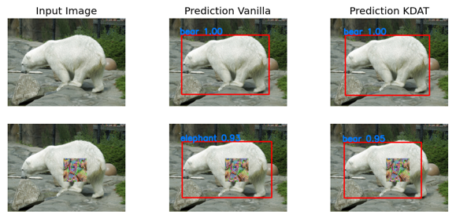
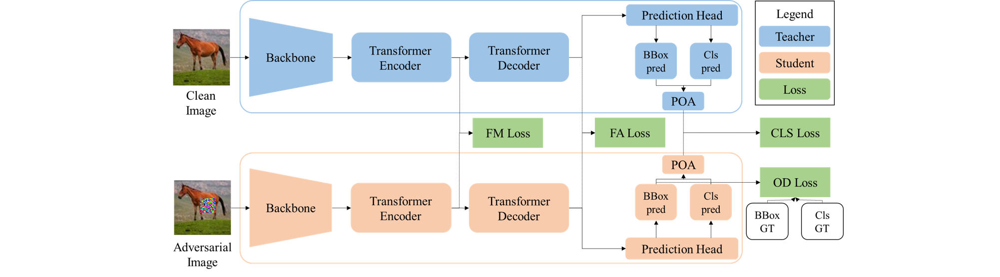

# Knowledge Distillation with Adversarial Tuning (KDAT)

Welcome to the official implementation for the AAAI-2025 paper KDAT: Inherent Adversarial Robustness via Knowledge Distillation with Adversarial Tuning for Object Detection Models.

<div align="center">
  
</div>

Provide a more detailed explanation of your project, including its goals and key aspects. Explain why this project exists and who might find it useful.

<div align="center">
  
</div>

## Installation

Detailed steps to install and set up the project locally:

Install dependencies:
   ```bash
   pip install -r requirements.txt
   ```

## Usage

Explain how to use your project. Provide examples, code snippets, or commands as necessary.

```bash
python main.py
```
