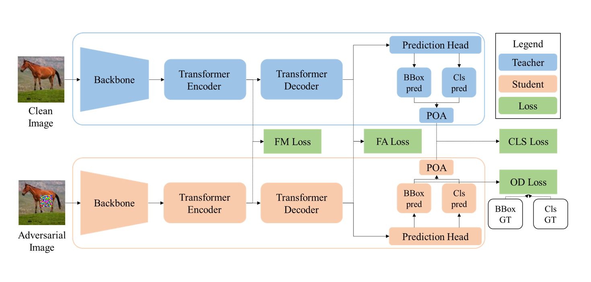

# Knowledge Distillation with Adversarial Tuning (KDAT)

Welcome to the official implementation for the AAAI-2025 paper KDAT: Inherent Adversarial Robustness via Knowledge Distillation with Adversarial Tuning for Object Detection Models.

<div align="center">
  
</div>

## Abstract
Adversarial patches pose a significant threat to computer vision models' integrity, decreasing the accuracy of various tasks, including object detection (OD).
Most existing OD defenses exhibit a trade-off between enhancing the model's adversarial robustness and maintaining its performance on benign images. 
We propose KDAT (knowledge distillation with adversarial tuning), a novel mechanism that enhances the robustness of an OD model without compromising its performance on benign images or its inference time.
Our method combines the knowledge distillation (KD) technique with the adversarial tuning concept to teach the model to match the predictions of adversarial images with those of their corresponding benign ones.
To match these predictions, we designed four unique loss components, allowing the student model to effectively distill the knowledge of different features from various parts of the teacher model.
Our extensive evaluation on the COCO and INRIA datasets demonstrates KDAT's ability to improve the performance of Faster R-CNN and DETR on benign images by 2-4 mAP\% and adversarial examples by 10-15 mAP\%, outperforming other state-of-the-art (SOTA) defenses.
Furthermore, our additional physical evaluation on the Superstore dataset demonstrates KDAT's SOTA adversarial robustness against printed patches (improvement of 22 mAP\% compared to the undefended model).
##
Leveraging OD models' modularity (interchangeable components such as backbone and detection heads), KDAT transfers informative features from various processing stages in the model's architecture.

<div align="center">
  
</div>

## Installation
Our proposed method and all the additional required code were implemented using PyTorch with Python 3.8, Numpy 1.24.3, and ART 1.15.1.
The required packages are detailed in the requirement file and can be installed using the following command:
   ```bash
   pip install -r requirements.txt
   ```

## Usage

### Using pre-trained KDAT models:
We provide the checkpoints for both Faster R-CNN and DETR [here](https://drive.google.com/drive/folders/1DkcY8UvqtEBgBQ6MMhkqBgcHkkfXAeLa?usp=drive_link).

The demo folder contains code demonstrating the usage of the provided weights on both benign and adversarial examples:
```
/KDAT/Demo
```

### Train KDAT:

The Defender directory is a versatile resource. It contains the abstract class BaseDefender, which serves as a foundation, and two successor classes that expand this class for two-stage detectors and transformer-based detectors. This versatility allows you to adapt the implementation to your specific needs.

The first step involves preparing an adversarial dataset and updating the config file accordingly which locate at:
```
/KDAT/Config.py
```
Creating an adversarial dataset is a key step when fine-tuning your model using KDAT. This dataset should include both training and validation sets, as demonstrated in the Demo/Adv_Dataset directory, with CSV files for each subset of the examples.

Then, run the Train_KDAT.py to fine-tune your model using KDAT.
```
/KDAT/Train_KDAT.py
```
